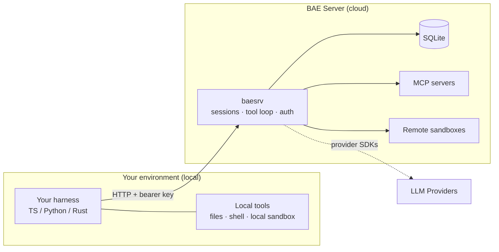

<p align="center">
  
</p>

<p align="center">
  <strong>Build multiplayer AI agents that run tools wherever they belong —<br>
  on your machine, in the cloud, or both at once — with durable, replayable sessions.</strong>
</p>

<p align="center">
  
</p>

<p align="center">
  <em>Status: alpha. The codebase, tooling, and project specification are in place; APIs and SDKs will likely change.</em>
</p>

---

`better-agent-engine` (a.k.a. BAE) is a "hybrid agent system" which allows combining remote and local execution to develop powerful AI agents. BAE client harness libraries (TypeScript, Python, and Rust) are ultra-customizable with both custom and builtin tools such as files, sandboxes, subagents, and more. `baesrv` is a tiny rust-based server which adds server-side sandboxes, MCP servers, durable sessions, and full RBAC, permissions, and LLM provider handling. BAE is natively multi-client which allows multiple clients or users to connect simultaneously to work together when driving an agent session. This combination of hybrid architecture and multiplayer capabilities allows for any task from simple to highly complex to be solved by your agents.

## What you get

- **Durable, replayable sessions out of the box.** Every message, provider call,
  tool call, and result is persisted server-side in SQLite. Restart a client,
  swap it for another, or reconnect after a crash — the full history is still
  there, and you can replay it from any point.
- ** True multiplayer built in.** Multiple client harnesses and users can connect
  to the same session simultaneously, each bringing their own set of local tools, 
  and all able to drive prompts while recieving a live stream of the entire session.
- **A harness you actually control.** The agent loop, tool dispatch, and prompting
  strategy are code *you* compose and override — not a black box. The wire
  protocol is extremely simple, allowing client harnesses to remain extremely lightweight.
- **Your language, your patterns.** First-class client libraries for **TypeScript,
  Python, and Rust**, at feature parity. Every capability exists in all three,
  designed for each language's own conventions.
- **Batteries included.** Built-in sandboxes, file tools, and server-managed MCP
  servers mean you're wiring together capabilities, not reimplementing them for every agent.

---

## The hybrid cloud/local model

BAE splits an agent into two cooperating halves and lets you deploy each half where
it makes sense:

- **`baesrv` (the server, remote)** owns everything durable — session logs, the
  tool-call loop, LLM provider connections, MCP servers, and auth. It's a single
  tiny rust binary with SQLite as its only datastore. One process to deploy, one
  database to back up.
- **Your custom harness (local)** connects to `baesrv` and runs *your* tools in *your*
  environment — with access to your filesystem, your network, your secrets, your
  local sandbox engine.

**Why this matters:** a tool call from the model can execute on your laptop or cluster
(reading a private repo, hitting an internal API) *in the same turn* as a
server-side MCP tool running in the cloud. You get the durability, centralized
auth, and always-on availability of a hosted service **and** the trust boundary,
local access, and iteration speed of code running on your own machines. Nothing
durable lives in the client, so clients stay trivially simple, disposable, and
interchangeable.



---

## The sandbox model: real execution on your terms

Agents that can run code are powerful and dangerous. BAE makes the security
boundary something *you* declare, not something you hope the model respects.

- **Two execution targets, chosen per call.** Bind `run_shell_command` or
  `run_shell_named` to your harness and decide — at the moment the LLM actually
  calls the tool — whether it runs in the **server's** sandbox (a container
  `baesrv` starts and execs into on your behalf) or your **harness's own local**
  container engine. Entirely controlled by your custom harness and `baesrv` profile.
- **Operator-controlled images.** A profile declares exactly which container
  images a session may launch. The server pre-pulls and verifies them in the background
  the instant the profile is created, so an agent's first sandbox call never stalls on
  a multi-hundred-megabyte image pull. Any image you didn't explicitly allow simply can't run.
- **Scoped file access.** Mount built-in `read_file` / `write_file` /
  `explore_files` tools with directory allowlists, extension rules, and
  filename regexes. Path-traversal-safe validation is vetted once and consistent
  across all three languages — an LLM-driven file tool can never touch a path you
  didn't permit.
- **Modular by design.** Docker and Apple Containers sit behind one common driver
  interface, so the same agent runs on a Linux server or a Mac laptop unchanged.

**The result**: you can give an agent genuine shell and filesystem power while keeping
the trust boundary (which images, which commands, local vs. remote, which
directories) entirely in your control.

---

## Multiplayer: many drivers, many observers, one session

A BAE session isn't a private one-to-one chat. Multiple clients can attach to the
**same** live session at once, each getting a complete real-time stream of
everything that happens.

- **Drivers** send messages and dispatch tool calls. The server serializes turns
  through a FIFO mutex — everyone's messages queue in order, each turn runs to
  completion before the next begins, and each driver's own tool calls are handled
  by that driver. Two teammates can pair on a shared debugging session, a
  human-in-the-loop reviewer can steer an agent mid-run, or several specialized
  clients can cooperate — **without anyone keeping a private copy of the
  conversation or coordinating turns out of band.**
- **Observers** subscribe read-only and watch every driver's activity live —
  provider calls, tool calls, results, joins — without any power to alter the
  session. Perfect for monitoring, audit, and "watch the agent work" UIs.
- **Independent toolsets, shared conversation.** Each driver can register its own
  distinct set of tools (as long as they're configured in the profile's allowlist) and still
  participate in one session — each turn only ever exposes the acting driver's
  tools to the model.

Because the server owns all state and streams every event, joining a session
means catching the full history *and* the live tail with no gaps, no double-delivery,
and resumable after a disconnect.

---

## MAX: a web dashboard for your BAE instance

**MAX** (multi-agent executor) is an optional web UI, shipped in the `bae-max`
container variant, that turns operating and debugging BAE into something you can
do from any browser (desktop, tablet, or phone).

- **Administer without a terminal.** Create, list, and revoke profiles and client
  keys from a dashboard instead of `docker exec`-ing a CLI or hand-assembling
  admin-API calls. LLM provider and MCP server configuration are fully available.
- **Watch any session as a live graph.** Open the Sessions tab, pick any session —
  running or historical — and see its events render live as an interactive graph:
  client turns, provider requests/responses, tool calls, MCP exchanges, joins.
  Click any node for its full JSON payload. Debug or audit an in-flight run
  **without writing your own observer harness.**
- **Observe safely.** MAX joins sessions strictly as an observer — it can *watch*
  everything and *drive* nothing, so pointing it at a live production session is
  never a risk.
- **Works everywhere.** Fully mobile- and tablet-friendly — mint a key, check a
  stuck session, or triage an incident from whatever device is in front of you.

Because MAX is a pure API client, everything it does is also possible via the `baesrv` admin API.

---

## Quickstart

```sh
docker run -p 8080:8080 -v bae-data:/var/lib/bae ghcr.io/prettysmartdev/better-agent-engine:latest
curl http://localhost:8080/healthz
```

Then create a profile and client key, exchange the key for a session, and send a
message. Full walkthrough: [`docs/guides/quickstart.md`](docs/guides/quickstart.md).

Want the dashboard? Run the `bae-max` variant instead —
`ghcr.io/prettysmartdev/better-agent-engine:max` — and open MAX in your browser.
See the [MAX Webapp guide](docs/guides/max-webapp.md).

## Learn more

- **[Documentation](docs/README.md)** — guides, API reference, and worked examples.
- **[Quickstart](docs/guides/quickstart.md)** — your first session, end to end.
- **[Multi-Client Sessions](docs/guides/multi-client-sessions.md)** — the
  multiplayer driver/observer model in practice.
- **[Sandboxes](docs/guides/sandboxes.md)** and
  **[File Tools](docs/guides/file-tools.md)** — safe, scoped execution.
- **[MCP Servers](docs/guides/mcp-servers.md)** — attach real MCP tools to a profile.
- **[Building a Client](docs/guides/building-a-client.md)** — the harness API in
  Rust, TypeScript, and Python.

## Contributing & development

Building from source, running the tests, and the project specification live in
**[DEVELOPING.md](DEVELOPING.md)**. Cutting a release is documented in
**[RELEASING.md](RELEASING.md)**.

## License

Apache-2.0 — see [LICENSE](LICENSE).
