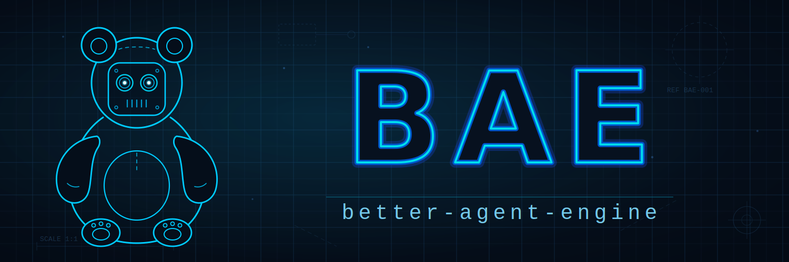

<p align="center">
  <strong>Stateful agent server with ultra customizable client harnesses.</strong> <br>
  Build agents with TypeScript, Python, or Rust to fit your exact needs.<br>
  <br>
  
</p>

<p align="center">
  
</p>

Better Agent Engine (BAE) gives you the best of cloud and local agents. The server 
persists all durable state (authentication, sessions, providers, events, etc.)
in SQLite. The client harness libraries — Rust, TypeScript, and Python —
give agent developers an idiomatic agent SDK in their language of choice while
staying thin, stateless, and ultra customizable with tools, loop hooks, and more.
Incorporate client-side tools with simple tool handlers and server-side MCP servers.

> Status: alpha. The codebase, tooling, and project specification are in place; APIs and SDKs will likely change.

## Quickstart

```sh
docker run -p 8080:8080 -v bae-data:/var/lib/bae better-agent-engine
curl http://localhost:8080/healthz
```

Then create a profile and client key via the admin API, exchange the key
for a session, and send a message. Full walkthrough:
[`docs/quickstart.md`](docs/quickstart.md).

## Local development

Everything runs in Docker via Make. The only host requirements are `docker`
and `make`.

```sh
make dev-image     # build the dev toolchain image (Rust, Node 22, Python/uv)
make build         # build all four components inside the container
make test          # run all tests
make lint          # clippy / tsc / ruff across components
make fmt           # format all components
make shell         # interactive shell in the dev container
```

Work on a single component with `<verb>-<component>`:

```sh
make test-server
make build-client-typescript
make lint-client-python
```

Inside the dev container (or on a host with the toolchains installed) you
can also work directly in a component directory: `make -C server test`.

Run `make help` for the full target list.

## Server

Build the production image and run it with a persistent data volume:

```sh
make image
docker run -p 8080:8080 -v bae-data:/var/lib/bae better-agent-engine
```

Configuration is environment-driven (see
[`aspec/devops/operations.md`](aspec/devops/operations.md)): `BAE_ADDR`,
`BAE_DB_PATH`, `BAE_LOG`, and provider credentials such as
`ANTHROPIC_API_KEY` are passed through the environment, never stored in the
database.

## Project specification (`aspec/`)

The `aspec/` tree is the source of truth for how this project is designed
and operated: [foundation](aspec/foundation.md),
[architecture](aspec/architecture/), [devops](aspec/devops/),
[UX](aspec/uxui/), [agents](aspec/genai/agents.md), and
[work items](aspec/work-items/). New feature work starts as a work item
following [`aspec/work-items/0000-template.md`](aspec/work-items/0000-template.md).

## License

Apache-2.0 — see [LICENSE](LICENSE).
