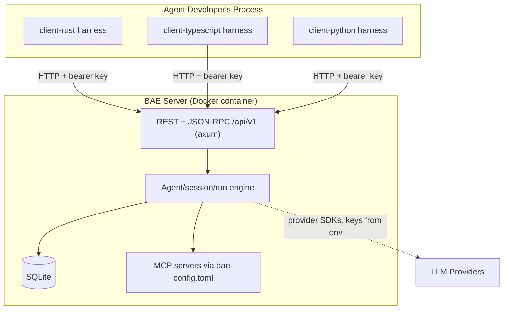

# Project Architecture

Pattern: monolith (single stateful server) with independent client libraries

## Design Principles

### Principle 1: Server owns all state
Description:
- The server is the single source of truth: agents, sessions, events, and runs are persisted in SQLite on the server. Clients hold no durable state and can be restarted, swapped, or run concurrently without coordination.
Reasoning:
- Stateful agents need durable, consistent history; centralizing it makes clients trivially simple, makes multi-language parity feasible, and keeps operations (backup, migration) a one-database problem.

### Principle 2: Thin protocol, customizable harness
Description:
- The wire protocol is small and stable. The client port is a deliberate hybrid: REST/HTTP for management operations (session CRUD, metadata, event history — small, stable, unchanged) plus one JSON-RPC 2.0 endpoint (`POST /api/v1/sessions/{id}/rpc`) for the live session loop that needs streaming. Customizability lives in the client harnesses — the agent loop, tool dispatch, and prompting strategies are library code the developer composes and overrides, not server behavior.
- **Scoped exception — server-side MCP dispatch:** MCP servers (configured in `bae-config.toml`) are connected and invoked by the server, not client harnesses. This is a deliberate, bounded exception: an MCP server is an external process/service the *operator* configures; its tools are not application logic that belongs in a harness. The core principle ("tool implementations live in client harnesses") applies to agent-specific application tools; MCP dispatch is infrastructure-level and correctly lives server-side.
Reasoning:
- A small, stable protocol keeps three client implementations in lockstep and lets the server evolve independently; pushing customization to the client keeps the server generic across wildly different agent designs. Server-side MCP dispatch is scoped narrowly to the streaming loop so it does not pollute the REST surface.

### Principle 3: Independent components, identical verbs
Description:
- server/, client-rust/, client-typescript/, and client-python/ are each independently buildable, testable, versioned, and publishable, and every component Makefile exposes the same verbs (build, test, lint, fmt, clean).
Reasoning:
- Independent release cadence avoids lockstep versioning pain across three registries and a Docker image; uniform verbs keep local dev and CI one simple loop over components.

## High-level Architecture:

## Major Components

### Component 1:
Name: baesrv (server/)
Purpose: Stateful HTTP service owning all durable agent state.
Description and Scope:
- Rust binary exposing the versioned REST + JSON-RPC API; persists agents, sessions, events, and runs in SQLite; runs embedded, forward-only migrations at startup; connects to operator-configured MCP servers.
- Scope: API surface, persistence, authentication/RBAC, run lifecycle, server-side MCP dispatch (see Principle 2 for the rationale). Out of scope: agent loop logic, prompting strategies, application tool implementations (those live in client harnesses).

### Component 2:
Name: bae-rs (client-rust/)
Purpose: Idiomatic Rust client library and harness.
Description and Scope:
- Typed HTTP client over /api/v1 plus a composable agent-loop harness; published to crates.io.
- Scope: protocol types, transport, harness traits and default loop. Stateless by design.

### Component 3:
Name: @prettysmartdev/bae-ts (client-typescript/)
Purpose: Idiomatic TypeScript client library and harness.
Description and Scope:
- Same surface as the Rust client, built on Node's fetch with zero runtime dependencies; published to npm.
- Scope: mirrors client-rust feature-for-feature with idiomatic TypeScript naming.

### Component 4:
Name: bae-py (client-python/)
Purpose: Idiomatic Python client library and harness.
Description and Scope:
- Same surface as the other clients, built on httpx/pydantic; published to PyPI.
- Scope: mirrors the other clients feature-for-feature with idiomatic Python naming (sync and async variants).
