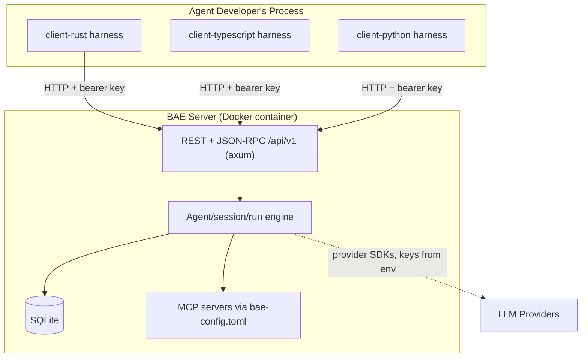

# Project Architecture

Pattern: monolith (single stateful server) with independent client libraries

## Design Principles

### Principle 1: Server owns all state
Description:
- The server is the single source of truth: agents, sessions, events, and runs are persisted in SQLite on the server. Clients hold no durable state and can be restarted, swapped, or run concurrently without coordination.
Reasoning:
- Stateful agents need durable, consistent history; centralizing it makes clients trivially simple, makes multi-language parity feasible, and keeps operations (backup, migration) a one-database problem.

### Principle 2: Thin protocol, customizable harness
Description:
- The wire protocol is small and stable. The client port is a deliberate hybrid: REST/HTTP for management operations (session CRUD, metadata, event history — small, stable, unchanged) plus one JSON-RPC 2.0 endpoint (`POST /api/v1/sessions/{id}/rpc`) for the live session loop that needs streaming. Customizability lives in the client harnesses — the agent loop, tool dispatch, and prompting strategies are library code the developer composes and overrides, not server behavior.
- **Scoped exception — server-side MCP dispatch:** MCP servers (configured in `bae-config.toml`) are connected and invoked by the server, not client harnesses. This is a deliberate, bounded exception: an MCP server is an external process/service the *operator* configures; its tools are not application logic that belongs in a harness. The core principle ("tool implementations live in client harnesses") applies to agent-specific application tools; MCP dispatch is infrastructure-level and correctly lives server-side.
Reasoning:
- A small, stable protocol keeps three client implementations in lockstep and lets the server evolve independently; pushing customization to the client keeps the server generic across wildly different agent designs. Server-side MCP dispatch is scoped narrowly to the streaming loop so it does not pollute the REST surface.

### Principle 3: Independent components, identical verbs
Description:
- server/, client-rust/, client-typescript/, and client-python/ are each independently buildable and testable, and every component Makefile exposes the same verbs (build, test, lint, fmt, clean). They publish together at a single shared version — one `vX.Y.Z` release stamps all three SDKs and both images (see devops/cicd.md) — each SDK going to its own registry.
Reasoning:
- Uniform per-component build/test verbs keep local dev and CI one simple loop over components; a single shared release version gives users one number to reason about across the client libraries and the server image, and keeps `/api/v1` the one compatibility contract to track.

## High-level Architecture:

## Major Components

### Component 1:
Name: baesrv (server/)
Purpose: Stateful HTTP service owning all durable agent state.
Description and Scope:
- Rust binary exposing the versioned REST + JSON-RPC API; persists agents, sessions, events, and runs in SQLite; runs embedded, forward-only migrations at startup; connects to operator-configured MCP servers.
- Scope: API surface, persistence, authentication/RBAC, run lifecycle, server-side MCP dispatch (see Principle 2 for the rationale). Out of scope: agent loop logic, prompting strategies, application tool implementations (those live in client harnesses).
- **OpenTelemetry (work item 0013).** `baesrv` is the OTel SDK owner: when `[telemetry]` is enabled in `bae-config.toml` it brings up its own tracer/meter providers and OTLP exporter, instruments the session/turn/provider/tool-dispatch span hierarchy via a `tracing-opentelemetry` layer, and publishes platform-health metrics (open sessions, connected clients, events/hour, etc.) sourced from state the engine already maintains. Off (no spans, no metrics, no OTLP traffic) unless explicitly configured — a deployment that never touches `[telemetry]` sees zero behavior change. See [Configuration — `[telemetry]`](../../docs/reference/configuration.md#telemetry).

### Component 2:
Name: bae-rs (client-rust/)
Purpose: Idiomatic Rust client library and harness.
Description and Scope:
- Typed HTTP client over /api/v1 plus a composable agent-loop harness; published to crates.io.
- Scope: protocol types, transport, harness traits and default loop. Stateless by design.
- **OpenTelemetry (work item 0013).** Depends on the `opentelemetry` API crate only (never `opentelemetry_sdk`/an exporter as a runtime dependency); calls it against whatever ambient/global `TracerProvider` the embedding application installed, injecting W3C `traceparent`/`tracestate` on every outbound request. With no host-installed OTel SDK, every call resolves to Rust's built-in no-op tracer — zero overhead, no header written, no BAE-specific client config surface.

### Component 3:
Name: @prettysmartdev/bae-ts (client-typescript/)
Purpose: Idiomatic TypeScript client library and harness.
Description and Scope:
- Same surface as the Rust client, built on Node's fetch with zero runtime dependencies; published to npm.
- Scope: mirrors client-rust feature-for-feature with idiomatic TypeScript naming.
- **OpenTelemetry (work item 0013) — scoped exception to the zero-runtime-dependencies line above.** `@opentelemetry/api` becomes this package's **first-ever runtime dependency**. This is a deliberate, narrowly-scoped exception, not a precedent for adding further runtime deps: the `@opentelemetry/api` package is API-surface only (no exporter/SDK weight) and is a genuine no-op without a host application's own OTel SDK installed, so it preserves the "invisible unless configured" goal the zero-deps principle exists to protect. Future work items should not read this as license to add other runtime dependencies under the same reasoning.

### Component 4:
Name: bae-py (client-python/)
Purpose: Idiomatic Python client library and harness.
Description and Scope:
- Same surface as the other clients, built on httpx/pydantic; published to PyPI.
- Scope: mirrors the other clients feature-for-feature with idiomatic Python naming (sync and async variants).
- **OpenTelemetry (work item 0013).** Depends on `opentelemetry-api` only (never `opentelemetry-sdk`, which stays a dev-only test dependency); calls it against the embedding application's ambient tracer, injecting `traceparent`/`tracestate` on every outbound request via `contextvars`-based propagation. No host SDK installed → the API's built-in no-op tracer → zero overhead, no header written.

### Component 5:
Name: baectl (baectl/)
Purpose: Thin CLI wrapper over the admin API (`/admin/v1/*`), bundled into both the dev and production images so operators can `docker exec`/`container exec` in and manage profiles and keys without hand-assembling curl calls.
Description and Scope:
- Rust binary, independently buildable like every other Rust component (own `Cargo.toml`, no shared workspace with `server/` or `client-rust/`), compiled to a static `x86_64-unknown-linux-musl` binary and copied into both images alongside `baesrv`.
- Scope: profile and key CRUD against the admin port, plus two local (no-network-required) scaffolding utilities: `auth create key`, for pre-provisioning one shared admin credential across multiple server replicas, and `setup`, an interactive quickstart wizard that generates a runnable deployment (`docker-compose.yml`/`bae-setup.sh`, `.env`, `bae-config.toml`) and optionally launches it, creating a first profile/key by shelling out to `baectl create profile`/`create key` **inside** the newly-started container (the admin port is loopback-only inside the container, never reachable from the host `setup` runs on). Auto-configures its admin address and auth token to zero-flag defaults matching the documented `docker exec` deployment model.
- Out of scope: session management (open/send-message/close), which hits the client port with a client/session key and is deliberately left to the published client libraries (Components 2–4) — baectl only talks to the admin port.
- **Distinguished from Components 2–4: baectl is not a published library.** It is not released to crates.io, npm, or PyPI — it ships only inside the Docker image, and its version tracks the image tag rather than an independent SemVer line (see devops/cicd.md's Publishing section). Components 2–4 are the publishable, embeddable client libraries; baectl is an operator-facing binary with no importable API surface.

### Component 6:
Name: max (max/)
Purpose: Browser dashboard for administering and observing a running `baesrv` — profile/key CRUD and a live, per-session event graph — for operators who want a web UI instead of `baectl`/raw admin-API calls.
Description and Scope:
- Two independent sub-packages, `max/web` (Vite + React, builds to a static `dist/`) and `max/server` (Node.js/Express + `ws`), structured like every other component: own manifests, no shared workspace with the Rust components. Bundled only into the second `bae-max` container image variant (see devops/infrastructure.md), not the default image.
- Scope: **pure API client — no direct DB access, no server-side state beyond its own credentials cache** (the admin key it resolves at startup, its lazily-provisioned per-profile observer client keys, and its own login secret). Everything MAX's dashboard can do is already possible via the documented admin/client APIs (per uxui/interface.md's "the UI is a pure API client" mandate) — `max/server` is a thin proxy plus a client-port observer bridge, never a second source of truth.
- Out of scope: driving sessions. MAX's client-port usage is strictly `join` (REST) + `session.subscribe` (JSON-RPC) to observe — it never calls `session.registerDriver`/`session.sendMessage`, and holds no session-mutating capability at all.
- **Distinguished from Components 2–4, same as baectl: max is not a published library.** It is not released to crates.io, npm, or PyPI — it ships only inside the `bae-max` Docker image variant, and its version tracks that image tag rather than an independent SemVer line (see devops/cicd.md's Publishing section).
- **Out of scope (work item 0013): visualizing OpenTelemetry trace/metric data.** WI 0013 adds OTel spans and metrics throughout `baesrv` and the client SDKs, but rendering that trace/metric data in a UI is explicitly not part of this work item — MAX remains an event-log/session dashboard, not an OTel/traces backend. An operator viewing exported spans and metrics still needs their own observability stack (the collector `[telemetry].otlp_endpoint` points at). Flagged here rather than silently decided either way; folding trace/metric visualization into MAX is a candidate for a future work item.

### Component 7:
Name: launcher-schedule (launchers/schedule/)
Purpose: Base Docker image (`bae-launcher-schedule`) an agent developer's own Dockerfile extends to run one or more of their own agent harnesses on a cron schedule, inside a single deployable container, with no scheduling/timer/process-supervision code of their own.
Description and Scope:
- Rust binary `baesched`, independently buildable like every other Rust component (own `Cargo.toml`, no shared workspace). Reads `bae-schedules.toml`'s `[[agents]]` array, registers one `tokio-cron-scheduler` job per agent, and spawns each agent's configured child process on its own schedule with templated `${VAR}`-resolved env/args.
- Scope: config loading (missing = warn, malformed = fatal exit 2), cron registration, same-agent overlap-skip (different agents always run concurrently, unthrottled), signal handling with a bounded shutdown grace period. Has **no HTTP surface at all** — liveness is process-level only (`docker ps`), by design.
- Depends on the internal shared library `launchers/core/` (package `launcher-core`, a plain Cargo path dependency — see below) for `${VAR}` resolution, child spawning/output streaming with per-agent log-line prefixing, unique-name validation, logging init, and the shared exit-code convention. Never imports `server/`, a client SDK, or `baectl/`.
- **Distinguished from Components 2–4, same as `baectl`/`max`: not a published library.** Not released to crates.io — it ships only inside the `bae-launcher-schedule` image, and its version tracks that image tag rather than an independent SemVer line (see devops/cicd.md's Publishing section). `Cargo.toml` carries `publish = false` permanently.

### Component 8:
Name: launcher-api (launchers/api/)
Purpose: Base Docker image (`bae-launcher-api`) an agent developer extends to expose one or more of their own agent harnesses as validated JSON HTTP endpoints, so an external system (webhook, CI job, another service) can trigger a harness over HTTP without them writing an HTTP server, request validation, or argument-templating code of their own.
Description and Scope:
- Rust binary `baeapi`, independently buildable like `launcher-schedule`. Reads `bae-api.toml`'s `[[agents]]` array and serves one shared `axum` router — `POST /agents/{name}/trigger` per configured agent (JSON Schema-validated body → env/arg templating → spawn → streamed NDJSON response), plus fixed `GET /healthz` and `GET /_launcher/agents`/`GET /_launcher/agents/{name}` introspection routes (never leaking secret values) present on every instance.
- Scope: config loading (same missing/malformed posture as `launcher-schedule`), JSON Schema request validation, RFC 7807 error bodies, streamed/zero-persistence trigger responses, optional bearer-token auth (`BAE_LAUNCHER_API_TOKEN`, unset by default — open port with a loud startup warning). Concurrent triggers of the same or different agents run fully independently with no locking, deliberately asymmetric with the schedule launcher's same-agent overlap-skip.
- Also depends on `launchers/core/` for the same primitives as `launcher-schedule` — the two crates share code with each other freely (both live under `launchers/`) while still depending on nothing outside that family.
- **Reused unmodified by Component 9 (`launcher-webapp`)** — the exact same `baeapi` binary powers both the `bae-launcher-api` and `bae-launcher-webapp` images; the webapp image only adds a `BAE_LAUNCHER_WEBAPP_STATIC_DIR`-gated static-file-serving behavior already built into this binary.
- **Distinguished from Components 2–4, same as `baectl`/`max`: not a published library.** `publish = false` permanently, ships only inside its own image(s).

### Component 9:
Name: launcher-webapp (launchers/webapp/)
Purpose: Base Docker image (`bae-launcher-webapp`) giving a non-technical operator a browser dashboard — a card per configured agent, a chat-style detail view — to trigger and interact with a packaged agent harness without knowing curl, the agent's JSON Schema, or the container's command line.
Description and Scope:
- One sub-package, `launchers/webapp/web` (Vite + React, builds to a static `dist/`), structured like `max/web` — own manifest, `"private": true` permanently, `@prettysmartdev/bae-launcher-webapp-web`. Bundled only into this third image variant.
- **No second backend process** — unlike `max` (Component 6), there is no `launchers/webapp/server/`. The frontend talks directly to Component 8's own `baeapi` JSON routes (`GET /_launcher/agents(/{name})`, `POST /agents/{name}/trigger`) via same-origin `fetch`, because `baeapi` already serves plain, unauthenticated-by-default JSON with no admin-key/session-key indirection to hide from the browser the way MAX's admin/client key material had to be. This makes `bae-launcher-webapp` structurally simpler than `bae-max`: one process, no dual-process entrypoint script, no signal-forwarding, no "either process dying kills the container" logic.
- Scope: card-grid home screen scaling from one to many agents (with an explanatory empty state for zero), a per-agent chat view (free-form input plus config-defined prompt buttons) that renders the streamed trigger response live, with no client- or server-side chat history persistence — a refresh clears the transcript.
- Config is `bae-app.toml`, Component 8's `bae-api.toml` schema plus optional presentation fields (`display_name`, `description`, `icon`, `chat_input_field`, `[[agents.prompts]]`) that `baeapi` already parses and simply ignores when running as the plain API launcher.
- **Distinguished from Components 2–4, same as `baectl`/`max`: not a published library.** `launchers/webapp/web/package.json` carries `"private": true` permanently, ships only inside the `bae-launcher-webapp` image.

**`launchers/core/` (a shared internal library, not independently user-facing) is a dependency inside Components 7 and 8's own descriptions above, not a numbered component of its own** — the same reasoning this document already applies to not listing internal `server/` modules as separate components. It is a plain Cargo path dependency (`launcher-core = { path = "../core" }`) of both `launchers/schedule/` and `launchers/api/`, with no root Cargo workspace; it has no HTTP or cron knowledge of its own and depends on nothing outside `launchers/`. Its `Cargo.toml` also carries `publish = false` permanently, even though nothing outside `launchers/` ever depends on it — the marker is about registry visibility, not about who consumes it.
